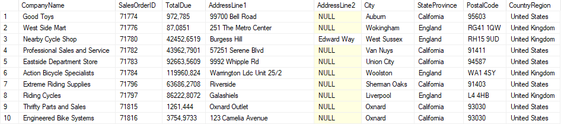
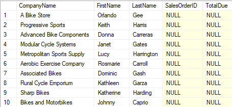
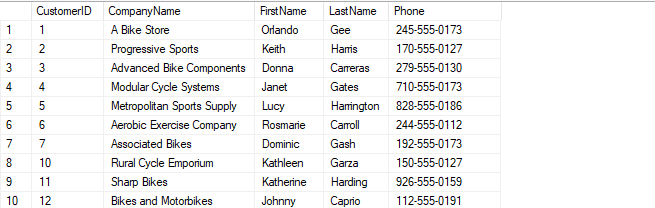
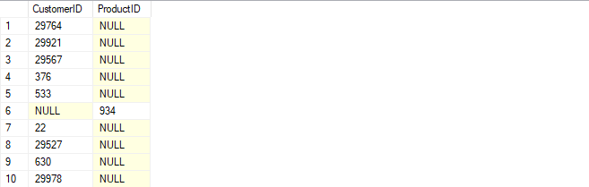

# Лабораторная работа 3 - Запросы к нескольким таблицам с соединениями


## Задача 1: Создание отчетов по счетам

### 1. Получите заказы клиентов
Напишите запрос, который возвращает название компании (`CompanyName`) из таблицы `Customer`, а также идентификатор заказа (`SalesOrderID`) и итоговую стоимость (`TotalDue`) из таблицы `SalesOrderHeader`.

```sql
SELECT C.CompanyName, SOH.SalesOrderID, SOH.TotalDue
FROM SalesLT.Customer C
JOIN SalesLT.SalesOrderHeader SOH
    ON C.CustomerID = SOH.CustomerID;
```


### 2. Получите заказы клиентов с адресами
Расширьте предыдущий запрос, чтобы включить адрес главного офиса каждого клиента (столбцы `AddressLine1`, `AddressLine2`, `City`, `StateProvince`, `PostalCode`, `CountryRegion`).

```sql
SELECT C.CompanyName, SOH.SalesOrderID, SOH.TotalDue, A.AddressLine1, A.AddressLine2, A.City, 
       A.StateProvince, A.PostalCode, A.CountryRegion
FROM SalesLT.Customer C
JOIN SalesLT.SalesOrderHeader SOH
    ON C.CustomerID = SOH.CustomerID
JOIN SalesLT.CustomerAddress CA
    ON C.CustomerID = CA.CustomerID
JOIN SalesLT.Address A
    ON CA.AddressID = A.AddressID
WHERE CA.AddressType = 'Main Office';
```



## Задача 2: Получение данных по продажам

### 1. Получить список всех клиентов и их заказов
Напишите запрос, который возвращает все компании-клиенты с их именами, контактами (имя и фамилия), идентификатором заказа (`SalesOrderID`) и общей суммой (`TotalDue`). Клиенты без заказов должны быть включены с `NULL` в столбцах заказа и суммы.

```sql
SELECT C.CompanyName, C.FirstName, C.LastName, SOH.SalesOrderID, SOH.TotalDue
FROM SalesLT.Customer C
LEFT JOIN SalesLT.SalesOrderHeader SOH
    ON C.CustomerID = SOH.CustomerID
ORDER BY SOH.SalesOrderID;
```



### 2. Получить список клиентов без адреса
Напишите запрос, который возвращает клиентов, у которых нет записей в таблице `CustomerAddress`, включая `CustomerID`, `CompanyName`, `FirstName`, `LastName` и `Phone`.

```sql
SELECT C.CustomerID, C.CompanyName, C.FirstName, C.LastName, C.Phone
FROM SalesLT.Customer C
LEFT JOIN SalesLT.CustomerAddress CA
    ON C.CustomerID = CA.CustomerID
WHERE CA.CustomerID IS NULL;
```



### 3. Получить список клиентов и товаров без заказов
Создайте запрос, который возвращает список клиентов, не сделавших заказов, и товаров, которые никогда не заказывались.

```sql
SELECT C.CustomerID, NULL AS ProductID
SELECT C.CustomerID, P.ProductID
FROM SalesLT.Customer C
FULL JOIN SalesLT.SalesOrderHeader SOH
    ON C.CustomerID = SOH.CustomerID
FULL JOIN SalesLT.Product P
    ON 1 = 1  -- фиктивное условие для объединения с таблицей продуктов
FULL JOIN SalesLT.SalesOrderDetail SOD
    ON P.ProductID = SOD.ProductID
WHERE SOH.CustomerID IS NULL OR SOD.ProductID IS NULL;

```


