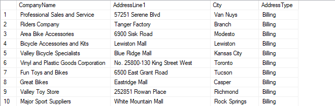
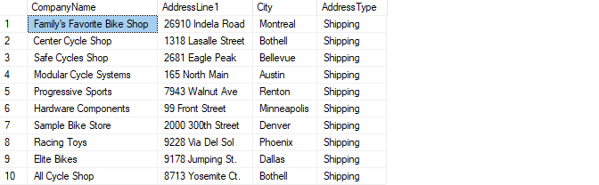
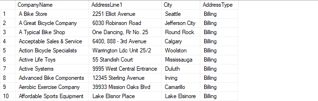
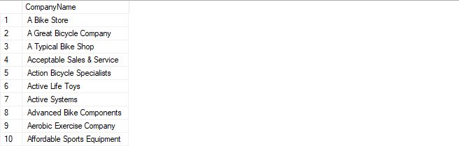
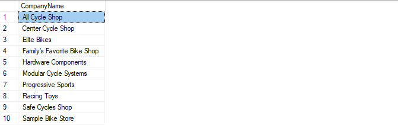

# Лабораторная работа 4 - Использование операторов для работы со множествами

## Задача 1: Получение адресов клиентов

### 1. Получите платежные адреса
Напишите запрос, который извлекает название компании, первую строку адреса улицы (`AddressLine1`), город (`City`) и столбец с именем `AddressType` со значением `'Billing'` для клиентов, у которых тип адреса в таблице `CustomerAddress` указан как `'Main Office'`.

```sql
SELECT C.CompanyName, A.AddressLine1, A.City, 'Billing' AS AddressType
FROM SalesLT.Customer C
JOIN SalesLT.CustomerAddress CA
    ON C.CustomerID = CA.CustomerID
JOIN SalesLT.Address A
    ON CA.AddressID = A.AddressID
WHERE CA.AddressType = 'Main Office';
```



### 2. Получите адрес доставки
Создайте запрос, аналогичный предыдущему, но вместо платежного адреса извлеките адрес доставки (`Shipping`), указав `AddressType` как `'Shipping'`.

```sql
SELECT C.CompanyName, A.AddressLine1, A.City, 'Shipping' AS AddressType
FROM SalesLT.Customer C
JOIN SalesLT.CustomerAddress CA
    ON C.CustomerID = CA.CustomerID
JOIN SalesLT.Address A
    ON CA.AddressID = A.AddressID
WHERE CA.AddressType = 'Shipping';
```



### 3. Объедините платежный адрес и адрес доставки
Объедините результаты двух предыдущих запросов, чтобы получить список всех адресов клиентов, отсортированный по названию компании и типу адреса.

```sql
SELECT C.CompanyName, A.AddressLine1, A.City, 'Billing' AS AddressType
FROM SalesLT.Customer C
JOIN SalesLT.CustomerAddress CA
    ON C.CustomerID = CA.CustomerID
JOIN SalesLT.Address A
    ON CA.AddressID = A.AddressID
WHERE CA.AddressType = 'Main Office'

UNION

SELECT C.CompanyName, A.AddressLine1, A.City, 'Shipping' AS AddressType
FROM SalesLT.Customer C
JOIN SalesLT.CustomerAddress CA
    ON C.CustomerID = CA.CustomerID
JOIN SalesLT.Address A
    ON CA.AddressID = A.AddressID
WHERE CA.AddressType = 'Shipping'
ORDER BY CompanyName, AddressType;
```



## Задача 2: Отфильтруйте адреса клиентов

### 1. Получите клиентов, имеющих только адрес главного офиса
Напишите запрос, который возвращает название компании (`CompanyName`) для каждой компании, которая указана с типом адреса `Main Office`, но не с типом адреса `Shipping`.

```sql
SELECT C.CompanyName
FROM SalesLT.Customer C
JOIN SalesLT.CustomerAddress CA
    ON C.CustomerID = CA.CustomerID
WHERE CA.AddressType = 'Main Office'

EXCEPT

SELECT C.CompanyName
FROM SalesLT.Customer C
JOIN SalesLT.CustomerAddress CA
    ON C.CustomerID = CA.CustomerID
WHERE CA.AddressType = 'Shipping';
```



### 2. Получите клиентов, имеющих оба типа адреса
Напишите запрос, который возвращает название компании (`CompanyName`) для каждой компании, которая указана как с адресом `Main Office`, так и с адресом `Shipping`.

```sql
SELECT C.CompanyName
FROM SalesLT.Customer C
JOIN SalesLT.CustomerAddress CA
    ON C.CustomerID = CA.CustomerID
WHERE CA.AddressType = 'Main Office'

INTERSECT 

SELECT C.CompanyName
FROM SalesLT.Customer C
JOIN SalesLT.CustomerAddress CA
    ON C.CustomerID = CA.CustomerID
WHERE CA.AddressType = 'Shipping';
```


