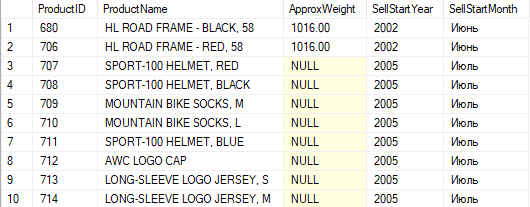

# Лабораторная работа 5 - Использование функций и агрегирование данных


---

## Задача 1: Получение информации о товарах

### 1. Получите наименование и приблизительный вес каждого товара

Запрос, который возвращает идентификатор товара, наименование товара в верхнем регистре и вес, округленный до ближайшего целого:

```sql
SELECT 
    ProductID, 
    UPPER(Name) AS ProductName, 
    ROUND(Weight, 0) AS ApproxWeight
FROM 
    SalesLT.Product;
```


---

### 2. Получите год и месяц, когда товары были впервые проданы

Запрос с добавлением года и названия месяца начала продаж:

```sql
SELECT 
    ProductID, 
    UPPER(Name) AS ProductName, 
    ROUND(Weight, 0) AS ApproxWeight,
    YEAR(SellStartDate) AS SellStartYear,
    DATENAME(MONTH, SellStartDate) AS SellStartMonth
FROM 
    SalesLT.Product;
```



---

### 3. Получите типы товаров из номеров товаров

Запрос с добавлением первых двух символов из номера товара:

```sql
SELECT 
    ProductID, 
    UPPER(Name) AS ProductName, 
    ROUND(Weight, 0) AS ApproxWeight,
    YEAR(SellStartDate) AS SellStartYear,
    DATENAME(MONTH, SellStartDate) AS SellStartMonth,
    LEFT(ProductNumber, 2) AS ProductType
FROM 
    SalesLT.Product;
```


---

### 4. Получите только товары, имеющие числовой размер

Запрос с фильтрацией товаров, имеющих числовой размер:

```sql
SELECT 
    ProductID, 
    UPPER(Name) AS ProductName, 
    ROUND(Weight, 0) AS ApproxWeight,
    YEAR(SellStartDate) AS SellStartYear,
    DATENAME(MONTH, SellStartDate) AS SellStartMonth,
    LEFT(ProductNumber, 2) AS ProductType
FROM 
    SalesLT.Product
WHERE 
    ISNUMERIC(Size) = 1;
```


---

## Задача 2: Ранжирование клиентов по доходу

### 1. Получите компании, отранжированные по суммам продаж

Запрос для получения списка компаний с доходами и их ранжированием:

```sql
SELECT 
    C.CompanyName, 
    SOH.TotalDue AS Revenue,
    RANK() OVER (ORDER BY SOH.TotalDue DESC) AS RankByRevenue
FROM 
    SalesLT.Customer C
JOIN 
    SalesLT.SalesOrderHeader SOH
    ON C.CustomerID = SOH.CustomerID;
```


---

## Задача 3: Агрегирование данных по продажам товаров

### 1. Получите общий объем продаж по товару

Запрос для получения списка товаров и их общей суммы продаж:

```sql
SELECT 
    P.Name, 
    SUM(SOD.LineTotal) AS TotalRevenue
FROM 
    SalesLT.Product P
JOIN 
    SalesLT.SalesOrderDetail SOD
    ON P.ProductID = SOD.ProductID
GROUP BY 
    P.Name
ORDER BY 
    TotalRevenue DESC;
```


---

### 2. Отфильтруйте список продаж товаров, включив в него только те товары, стоимость которых превышает $1000

Измененный запрос с фильтрацией товаров по цене:

```sql
SELECT 
    P.Name, 
    SUM(SOD.LineTotal) AS TotalRevenue
FROM 
    SalesLT.Product P
JOIN 
    SalesLT.SalesOrderDetail SOD
    ON P.ProductID = SOD.ProductID
WHERE 
    SOD.LineTotal > 1000
GROUP BY 
    P.Name
ORDER BY 
    TotalRevenue DESC;
```


---

### 3. Отфильтруйте группы продаж товаров так, чтобы включить только те из них, общий объем продаж которых более $20000

Измененный запрос с фильтрацией по агрегированной сумме:

```sql
SELECT 
    P.Name, 
    SUM(SOD.LineTotal) AS TotalRevenue
FROM 
    SalesLT.Product P
JOIN 
    SalesLT.SalesOrderDetail SOD
    ON P.ProductID = SOD.ProductID
GROUP BY 
    P.Name
HAVING 
    SUM(SOD.LineTotal) > 20000
ORDER BY 
    TotalRevenue DESC;
```


