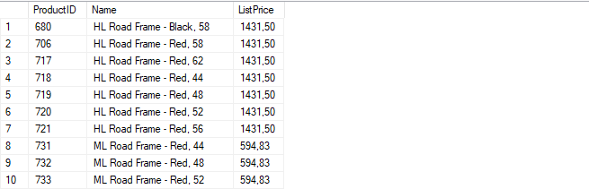
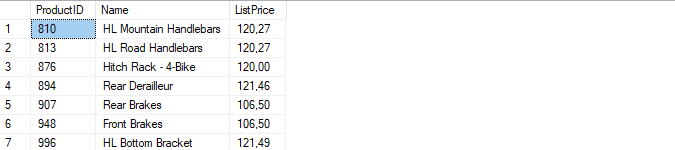
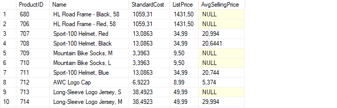
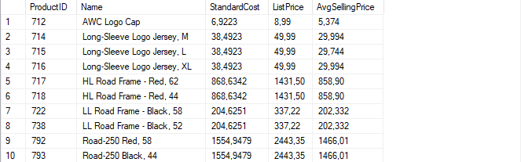
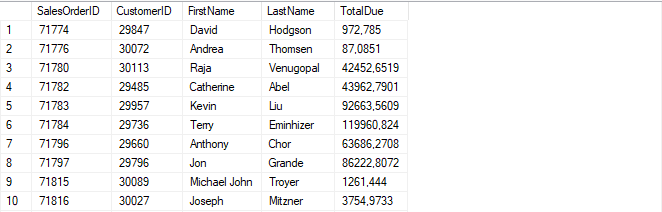
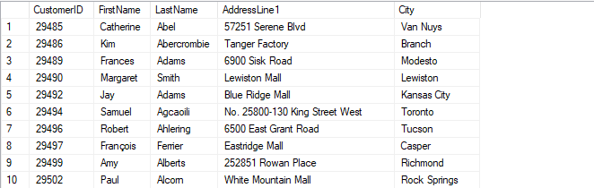

# Лабораторная работа 6 - Использование подзапросов и APPLY

---

## Задача 1: Получение информации о ценах на товары

### 1. Получите товары, у которых прейскурантная цена выше средней цены за товар

Запрос, который возвращает товары, чья прейскурантная цена выше средней цены за единицу товара для всех проданных товаров:

```sql
SELECT 
    ProductID, 
    Name, 
    ListPrice
FROM 
    SalesLT.Product
WHERE 
    ListPrice > (SELECT AVG(UnitPrice) FROM SalesLT.SalesOrderDetail)
ORDER BY 
    ProductID;
```



---

### 2. Получите товары с прейскурантной ценой в $100 или более, которые были проданы менее чем за $100

Запрос для получения товаров, чья прейскурантная цена составляет $100 или более, но они были проданы за менее чем $100:

```sql
SELECT 
    ProductID, 
    Name, 
    ListPrice
FROM 
    SalesLT.Product
WHERE 
    ListPrice >= 100 
    AND ProductID IN (
        SELECT ProductID 
        FROM SalesLT.SalesOrderDetail 
        WHERE UnitPrice < 100
    )
ORDER BY 
    ProductID;
```



---

### 3. Получите себестоимость, прейскурантную цену и среднюю цену продажи для каждого товара

Запрос для извлечения идентификатора товара, наименования, себестоимости, прейскурантной цены и средней цены продажи:

```sql
SELECT 
    P.ProductID, 
    P.Name, 
    P.StandardCost, 
    P.ListPrice, 
    (SELECT AVG(UnitPrice) 
     FROM SalesLT.SalesOrderDetail 
     WHERE ProductID = P.ProductID) AS AvgSellingPrice
FROM 
    SalesLT.Product P
ORDER BY 
    P.ProductID;
```



---

### 4. Получите товары, у которых средняя цена продажи ниже себестоимости

Запрос для фильтрации товаров, где себестоимость выше средней цены продажи:

```sql
SELECT 
    P.ProductID, 
    P.Name, 
    P.StandardCost, 
    P.ListPrice, 
    (SELECT AVG(UnitPrice) 
     FROM SalesLT.SalesOrderDetail 
     WHERE ProductID = P.ProductID) AS AvgSellingPrice
FROM 
    SalesLT.Product P
WHERE 
    P.StandardCost > (SELECT AVG(UnitPrice) 
                      FROM SalesLT.SalesOrderDetail 
                      WHERE ProductID = P.ProductID)
ORDER BY 
    P.ProductID;
```



---

## Задача 2: Получение информации о клиенте

### 1. Получите информацию о клиентах для всех заказов

Запрос для извлечения информации о клиентах из таблицы `SalesLT.SalesOrderHeader` и функции `dbo.ufnGetCustomerInformation`:

```sql
SELECT 
    SOH.SalesOrderID, 
    SOH.CustomerID, 
    CI.FirstName, 
    CI.LastName, 
    SOH.TotalDue
FROM 
    SalesLT.SalesOrderHeader SOH
CROSS APPLY 
    dbo.ufnGetCustomerInformation(SOH.CustomerID) AS CI
ORDER BY 
    SOH.SalesOrderID;
```



---

### 2. Получите информацию об адресе клиента

Запрос для извлечения информации об адресе клиента из таблиц `SalesLT.Address`, `SalesLT.CustomerAddress` и функции `dbo.ufnGetCustomerInformation`:

```sql
SELECT 
    C.CustomerID, 
    CI.FirstName, 
    CI.LastName, 
    A.AddressLine1, 
    A.City
FROM 
    SalesLT.Customer C
CROSS APPLY 
    dbo.ufnGetCustomerInformation(C.CustomerID) AS CI
JOIN 
    SalesLT.CustomerAddress CA ON C.CustomerID = CA.CustomerID
JOIN 
    SalesLT.Address A ON CA.AddressID = A.AddressID
ORDER BY 
    C.CustomerID;
```



