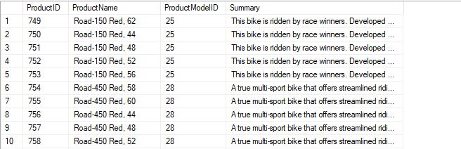
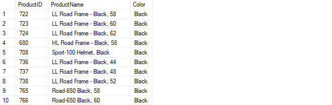
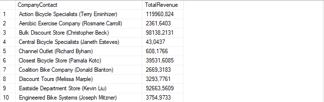

# Лабораторная работа 7 - Использование табличных выражений

---

## Задача 1: Получение данных о товаре

### 1. Получите описания модели товара

Запрос для получения идентификатора товара, названия товара, названия модели товара и описания модели:

```sql
SELECT 
    P.ProductID, 
    P.Name AS ProductName, 
    VPM.ProductModelID, 
    VPM.Summary
FROM 
    SalesLT.Product P
JOIN 
    SalesLT.vProductModelCatalogDescription VPM
    ON P.ProductModelID = VPM.ProductModelID
ORDER BY 
    P.ProductID;
```



---

### 2. Создайте таблицу с уникальными цветами

Запрос для создания табличной переменной с уникальными цветами и фильтрации товаров по этим цветам:

```sql
DECLARE @Colors TABLE (Color NVARCHAR(50));

INSERT INTO @Colors (Color)
SELECT DISTINCT Color
FROM SalesLT.Product
WHERE Color IS NOT NULL;

SELECT 
    P.ProductID, 
    P.Name AS ProductName, 
    P.Color
FROM 
    SalesLT.Product P
WHERE 
    P.Color IN (SELECT Color FROM @Colors)
ORDER BY 
    P.Color;
```



---

### 3. Создайте таблицу с уникальными размерами

Запрос для создания временной таблицы с уникальными размерами и фильтрации товаров по этим размерам:

```sql
CREATE TABLE #UniqueSizes (Size NVARCHAR(50));

INSERT INTO #UniqueSizes (Size)
SELECT DISTINCT Size
FROM SalesLT.Product
WHERE Size IS NOT NULL;

SELECT 
    P.ProductID, 
    P.Name AS ProductName, 
    P.Size
FROM 
    SalesLT.Product P
WHERE 
    P.Size IN (SELECT Size FROM #UniqueSizes)
ORDER BY 
    P.Size DESC;

DROP TABLE #UniqueSizes;
```


---

### 4. Получите родительские категории товаров

Запрос для получения товаров, их категорий и родительских категорий с использованием функции `dbo.ufnGetAllCategories`:

```sql
SELECT 
    P.ProductID, 
    P.Name AS ProductName, 
    AC.ParentCategory, 
    AC.Category
FROM 
    SalesLT.Product P
CROSS APPLY 
    dbo.ufnGetAllCategories(P.ProductCategoryID) AS AC
ORDER BY 
    AC.ParentCategory, 
    AC.Category, 
    P.Name;
```


---

## Задача 2: Получение информации по доходам от продаж клиентам

### 1. Получите доходы от продаж по клиентам и контактные данные (используйте производные таблицы)

Запрос для получения данных о доходах клиентов с использованием производной таблицы:

```sql
SELECT 
    CompanyContact, 
    SUM(Revenue) AS TotalRevenue
FROM (
    SELECT 
        C.CustomerID, 
        C.CompanyName + ' (' + C.FirstName + ' ' + C.LastName + ')' AS CompanyContact, 
        SOH.TotalDue AS Revenue
    FROM 
        SalesLT.Customer C
    JOIN 
        SalesLT.SalesOrderHeader SOH 
        ON C.CustomerID = SOH.CustomerID
) AS DerivedTable
GROUP BY 
    CompanyContact
ORDER BY 
    CompanyContact;
```


---

### 2. Получите доходы от продаж по клиентам и контактные данные (используйте CTE)

Запрос для получения данных о доходах клиентов с использованием обобщенного табличного выражения (CTE):

```sql
WITH CustomerRevenueCTE AS (
    SELECT 
        C.CustomerID, 
        C.CompanyName + ' (' + C.FirstName + ' ' + C.LastName + ')' AS CompanyContact, 
        SOH.TotalDue AS Revenue
    FROM 
        SalesLT.Customer C
    JOIN 
        SalesLT.SalesOrderHeader SOH 
        ON C.CustomerID = SOH.CustomerID
)
SELECT 
    CompanyContact, 
    SUM(Revenue) AS TotalRevenue
FROM 
    CustomerRevenueCTE
GROUP BY 
    CompanyContact
ORDER BY 
    CompanyContact;
```




COLLATE — для норм запроса 