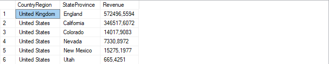
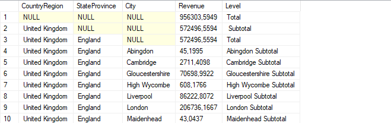

# Лабораторная работа 8 - Множества группировок и поворот данных

---

## Задача 1: Получение итогов продаж по регионам

### 1. Итоги для страны/региона и штата/провинции

Запрос для получения итогов доходов от продаж по стране/региону и штату/провинции:

```sql
SELECT 
    a.CountryRegion, 
    a.StateProvince, 
    SUM(soh.TotalDue) AS Revenue
FROM 
    SalesLT.Address AS a
INNER JOIN 
    SalesLT.CustomerAddress AS ca ON a.AddressID = ca.AddressID
INNER JOIN 
    SalesLT.Customer AS c ON ca.CustomerID = c.CustomerID
INNER JOIN 
    SalesLT.SalesOrderHeader AS soh ON c.CustomerID = soh.CustomerID
GROUP BY 
    a.CountryRegion, 
    a.StateProvince
ORDER BY 
    a.CountryRegion, 
    a.StateProvince;
```



---

### 2. Добавление общей и промежуточных сумм

Модифицированный запрос с использованием `GROUPING SETS` для добавления общей суммы всех доходов и промежуточных итогов для каждой страны/региона:

```sql
SELECT 
    a.CountryRegion, 
    a.StateProvince, 
    SUM(soh.TotalDue) AS Revenue
FROM 
    SalesLT.Address AS a
INNER JOIN 
    SalesLT.CustomerAddress AS ca ON a.AddressID = ca.AddressID
INNER JOIN 
    SalesLT.Customer AS c ON ca.CustomerID = c.CustomerID
INNER JOIN 
    SalesLT.SalesOrderHeader AS soh ON c.CustomerID = soh.CustomerID
GROUP BY GROUPING SETS (
    (a.CountryRegion, a.StateProvince),
    (a.CountryRegion),
    ()
)
ORDER BY 
    a.CountryRegion, 
    a.StateProvince;
```


---

### 3. Уровни группировки

Модифицированный запрос с добавлением уровня группировки и столбца `Level`:

```sql
SELECT 
    a.CountryRegion, 
    a.StateProvince, 
    SUM(soh.TotalDue) AS Revenue,
    CASE 
        WHEN GROUPING_ID(a.CountryRegion, a.StateProvince) = 0 THEN CONCAT(a.StateProvince, ' Subtotal')
        WHEN GROUPING_ID(a.CountryRegion) = 1 THEN CONCAT(a.CountryRegion, ' Subtotal')
        ELSE 'Total'
    END AS Level
FROM 
    SalesLT.Address AS a
INNER JOIN 
    SalesLT.CustomerAddress AS ca ON a.AddressID = ca.AddressID
INNER JOIN 
    SalesLT.Customer AS c ON ca.CustomerID = c.CustomerID
INNER JOIN 
    SalesLT.SalesOrderHeader AS soh ON c.CustomerID = soh.CustomerID
GROUP BY GROUPING SETS (
    (a.CountryRegion, a.StateProvince),
    (a.CountryRegion),
    ()
)
ORDER BY 
    a.CountryRegion, 
    a.StateProvince;
```


---

### 4. Добавление уровня группировки для городов

Модифицированный запрос с добавлением столбца `City` и уровня группировки для городов:

```sql
SELECT 
    a.CountryRegion, 
    a.StateProvince, 
    a.City, 
    SUM(soh.TotalDue) AS Revenue,
    CASE 
        WHEN GROUPING_ID(a.CountryRegion, a.StateProvince, a.City) = 0 THEN CONCAT(a.City, ' Subtotal')
        WHEN GROUPING_ID(a.CountryRegion, a.StateProvince) = 1 THEN CONCAT(a.StateProvince, ' Subtotal')
        WHEN GROUPING_ID(a.CountryRegion) = 2 THEN CONCAT(a.CountryRegion, ' Subtotal')
        ELSE 'Total'
    END AS Level
FROM 
    SalesLT.Address AS a
INNER JOIN 
    SalesLT.CustomerAddress AS ca ON a.AddressID = ca.AddressID
INNER JOIN 
    SalesLT.Customer AS c ON ca.CustomerID = c.CustomerID
INNER JOIN 
    SalesLT.SalesOrderHeader AS soh ON c.CustomerID = soh.CustomerID
GROUP BY GROUPING SETS (
    (a.CountryRegion, a.StateProvince, a.City),
    (a.CountryRegion, a.StateProvince),
    (a.CountryRegion),
    ()
)
ORDER BY 
    a.CountryRegion, 
    a.StateProvince, 
    a.City;
```



---

## Задача 2: Получение доходов от продаж по категориям

### 1. Доход от продаж для каждой родительской категории

Запрос с использованием оператора `PIVOT` для получения доходов по категориям:

```sql
SELECT 
    CompanyName,
    ISNULL([Accessories], 0) AS Accessories,
    ISNULL([Bikes], 0) AS Bikes,
    ISNULL([Clothing], 0) AS Clothing,
    ISNULL([Components], 0) AS Components
FROM (
    SELECT 
        C.CompanyName,
        PC.ParentCategory,
        SOD.LineTotal
    FROM 
        SalesLT.SalesOrderDetail SOD
    INNER JOIN 
        SalesLT.Product P ON SOD.ProductID = P.ProductID
    INNER JOIN 
        SalesLT.vGetAllCategories PC ON P.ProductCategoryID = PC.ProductCategoryID
    INNER JOIN 
        SalesLT.Customer C ON SOD.SalesOrderID = C.CustomerID
) AS SourceTable
PIVOT (
    SUM(LineTotal) 
    FOR ParentCategory IN ([Accessories], [Bikes], [Clothing], [Components])
) AS PivotTable
ORDER BY 
    CompanyName;
```


