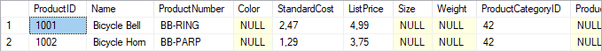
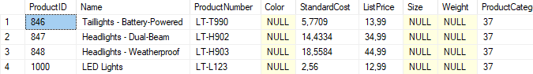

# Лабораторная работа 9 - Модификация данных

Эта лабораторная работа выполнена в базе данных **AdventureWorksLT**. В заданиях используются команды `INSERT`, `UPDATE` и `DELETE` для добавления, обновления и удаления данных.

---

## Задача 1: Добавление товаров

### 1. Добавьте новый товар

Добавление товара **LED Lights** в таблицу `SalesLT.Product`:

```sql
INSERT INTO SalesLT.Product (Name, ProductNumber, StandardCost, ListPrice, ProductCategoryID, SellStartDate)
VALUES ('LED Lights', 'LT-L123', 2.56, 12.99, 37, GETDATE());

SELECT ProductID
FROM SalesLT.Product
WHERE ProductNumber = 'LT-L123';

SELECT *
FROM SalesLT.Product
WHERE ProductNumber = 'LT-L123';
```


---

### 2. Добавьте новую категорию и два товара

Добавление категории **Bells and Horns** и двух товаров в нее:

```sql
-- Добавляем категорию "Bells and Horns"
INSERT INTO SalesLT.ProductCategory (ParentProductCategoryID, Name)
VALUES (4, 'Bells and Horns');

-- Получаем ID для новой категории
DECLARE @NewCategoryID INT;
SET @NewCategoryID = (SELECT ProductCategoryID FROM SalesLT.ProductCategory WHERE Name = 'Bells and Horns');

-- Добавляем товары в категорию "Bells and Horns"
INSERT INTO SalesLT.Product (Name, ProductNumber, StandardCost, ListPrice, ProductCategoryID, SellStartDate)
VALUES 
('Bicycle Bell', 'BB-RING', 2.47, 4.99, @NewCategoryID, GETDATE()),
('Bicycle Horn', 'BB-PARP', 1.29, 3.75, @NewCategoryID, GETDATE());

-- Проверяем вставленные данные
SELECT P.*, PC.Name AS CategoryName
FROM SalesLT.Product P
JOIN SalesLT.ProductCategory PC ON P.ProductCategoryID = PC.ProductCategoryID
WHERE PC.Name = 'Bells and Horns';
```


---

## Задача 2: Обновление информации по товарам

### 1. Обновление цен на товары

Обновление цен для товаров категории **Bells and Horns** с увеличением на 10%:

```sql
UPDATE SalesLT.Product
SET ListPrice = ListPrice * 1.1
WHERE ProductCategoryID = (SELECT ProductCategoryID FROM SalesLT.ProductCategory WHERE Name = 'Bells and Horns');

-- Проверяем обновленные данные
SELECT P.*, PC.Name AS CategoryName
FROM SalesLT.Product P
JOIN SalesLT.ProductCategory PC ON P.ProductCategoryID = PC.ProductCategoryID
WHERE PC.Name = 'Bells and Horns';
```



---

### 2. Прекращение продаж товаров

Прекращение продаж для товаров категории **Lights**, кроме нового товара **LED Lights**:

```sql
UPDATE SalesLT.Product
SET DiscontinuedDate = GETDATE()
WHERE ProductCategoryID = 37
  AND ProductNumber <> 'LT-L123';

-- Проверяем обновленные данные
SELECT *
FROM SalesLT.Product
WHERE ProductCategoryID = 37;
```



---

## Задача 3: Удаление товаров

### 1. Удаление категории и товаров в ней

Удаление категории **Bells and Horns** и связанных с ней товаров:

```sql
-- Удаляем товары из категории "Bells and Horns"
DELETE FROM SalesLT.Product
WHERE ProductCategoryID = (SELECT ProductCategoryID FROM SalesLT.ProductCategory WHERE Name = 'Bells and Horns');

-- Удаляем категорию "Bells and Horns"
DELETE FROM SalesLT.ProductCategory
WHERE Name = 'Bells and Horns';

-- Проверяем удаление
SELECT *
FROM SalesLT.ProductCategory
WHERE Name = 'Bells and Horns';

SELECT *
FROM SalesLT.Product
WHERE ProductCategoryID = (SELECT ProductCategoryID FROM SalesLT.ProductCategory WHERE Name = 'Bells and Horns');
```


