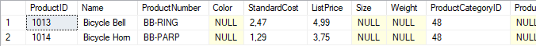

# Лабораторная работа 10 - Обработка ошибок и транзакции

Эта лабораторная работа выполнена в базе данных **AdventureWorksLT**. Задания включают реализацию обработки ошибок с помощью `TRY...CATCH` и использование транзакций для обеспечения согласованности данных.

---

## Задача 1: Журналирование ошибок

### 1. Выбросите ошибку для несуществующих заказов

Измененный код проверяет существование заказа перед удалением. Если заказ не существует, выбрасывается ошибка:

```sql
DECLARE @SalesOrderID INT = <ID_заказа_для_удаления>;

IF NOT EXISTS (
    SELECT 1
    FROM SalesLT.SalesOrderHeader
    WHERE SalesOrderID = @SalesOrderID
)
BEGIN
    THROW 50001, 'Заказ #' + CAST(@SalesOrderID AS NVARCHAR) + ' не существует.', 1;
END;

DELETE FROM SalesLT.SalesOrderDetail WHERE SalesOrderID = @SalesOrderID;
DELETE FROM SalesLT.SalesOrderHeader WHERE SalesOrderID = @SalesOrderID;
```


---

### 2. Обработка ошибок

Добавление блока `TRY...CATCH` для обработки ошибок. Ошибка записывается в лог и выводится сообщение:

```sql
BEGIN TRY
    DECLARE @SalesOrderID INT = <ID_заказа_для_удаления>;

    IF NOT EXISTS (
        SELECT 1
        FROM SalesLT.SalesOrderHeader
        WHERE SalesOrderID = @SalesOrderID
    )
    BEGIN
        THROW 50001, 'Заказ #' + CAST(@SalesOrderID AS NVARCHAR) + ' не существует.', 1;
    END;

    DELETE FROM SalesLT.SalesOrderDetail WHERE SalesOrderID = @SalesOrderID;
    DELETE FROM SalesLT.SalesOrderHeader WHERE SalesOrderID = @SalesOrderID;
END TRY
BEGIN CATCH
    PRINT 'Произошла ошибка: ' + ERROR_MESSAGE();
END CATCH;
```



---

## Задача 2: Обеспечение согласованности данных

### 1. Внедрение транзакций

Улучшение кода для обработки ошибок и транзакций. При сбое транзакция откатывается:

```sql
BEGIN TRY
    BEGIN TRANSACTION;

    DECLARE @SalesOrderID INT = <ID_заказа_для_удаления>;

    IF NOT EXISTS (
        SELECT 1
        FROM SalesLT.SalesOrderHeader
        WHERE SalesOrderID = @SalesOrderID
    )
    BEGIN
        THROW 50001, 'Заказ #' + CAST(@SalesOrderID AS NVARCHAR) + ' не существует.', 1;
    END;

    DELETE FROM SalesLT.SalesOrderDetail WHERE SalesOrderID = @SalesOrderID;

    -- Имитируем ошибку
    THROW 50002, 'Искусственная ошибка для проверки транзакции.', 1;

    DELETE FROM SalesLT.SalesOrderHeader WHERE SalesOrderID = @SalesOrderID;

    COMMIT TRANSACTION;
END TRY
BEGIN CATCH
    IF @@TRANCOUNT > 0
        ROLLBACK TRANSACTION;

    PRINT 'Ошибка: ' + ERROR_MESSAGE();
    THROW;
END CATCH;
```


