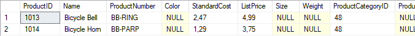

# Лабораторная работа 10 - Программирование на Transact-SQL

---

## Задача 1: Создание скриптов для добавления заказов

### 1. Добавление заголовка заказа

Скрипт для добавления заголовка заказа позволяет указывать дату заказа (`OrderDate`), срок платежа (`DueDate`) и идентификатор клиента (`CustomerID`). После выполнения выводится идентификатор заказа (`SalesOrderID`):

```sql
DECLARE @OrderDate DATE = GETDATE();
DECLARE @DueDate DATE = DATEADD(DAY, 7, @OrderDate);
DECLARE @CustomerID INT = 1;
DECLARE @SalesOrderNumber NVARCHAR(25) = 'SO-' + CAST(NEXT VALUE FOR SalesLT.SalesOrderNumber AS NVARCHAR);
DECLARE @SalesOrderID INT;

INSERT INTO SalesLT.SalesOrderHeader (
    OrderDate,
    DueDate,
    CustomerID,
    SalesOrderNumber,
    ShipMethod
)
VALUES (
    @OrderDate,
    @DueDate,
    @CustomerID,
    @SalesOrderNumber,
    'CARGO TRANSPORT 5'
);

SET @SalesOrderID = SCOPE_IDENTITY();

PRINT 'Добавлен заказ с SalesOrderID = ' + CAST(@SalesOrderID AS NVARCHAR);
```


---

### 2. Добавление товара к заказу

Скрипт проверяет, существует ли указанный заказ, и добавляет данные о товаре. Если заказа нет, выводится сообщение об ошибке:

```sql
DECLARE @SalesOrderID INT = <Укажите_ID_заказа>;
DECLARE @ProductID INT = 760;
DECLARE @Quantity INT = 1;
DECLARE @UnitPrice DECIMAL(10, 2) = 782.99;

IF EXISTS (SELECT 1 FROM SalesLT.SalesOrderHeader WHERE SalesOrderID = @SalesOrderID)
BEGIN
    INSERT INTO SalesLT.SalesOrderDetail (
        SalesOrderID,
        ProductID,
        OrderQty,
        UnitPrice
    )
    VALUES (
        @SalesOrderID,
        @ProductID,
        @Quantity,
        @UnitPrice
    );

    PRINT 'Товар добавлен в заказ с SalesOrderID = ' + CAST(@SalesOrderID AS NVARCHAR);
END
ELSE
BEGIN
    PRINT 'Ошибка: заказ с SalesOrderID = ' + CAST(@SalesOrderID AS NVARCHAR) + ' не существует.';
END;
```

#### Проверка 1:
- **SalesOrderID**: ID заказа, созданного на предыдущем шаге.
- **ProductID**: 760
- **Quantity**: 1
- **Unit Price**: 782.99



#### Проверка 2:
- **SalesOrderID**: 0 (несуществующий заказ).
- **ProductID**: 760
- **Quantity**: 1
- **Unit Price**: 782.99


---

## Задача 2: Обновление цен на велосипеды

Скрипт увеличивает цену на велосипеды категории "Bikes" на 10%, пока средняя цена не достигнет $2000 или максимальная цена не превысит $5000. После завершения выводятся средняя и максимальная цены:

```sql
DECLARE @MarketAvgPrice DECIMAL(10, 2) = 2000;
DECLARE @MaxAllowedPrice DECIMAL(10, 2) = 5000;
DECLARE @AvgPrice DECIMAL(10, 2);
DECLARE @MaxPrice DECIMAL(10, 2);

SELECT @AvgPrice = AVG(ListPrice), @MaxPrice = MAX(ListPrice)
FROM SalesLT.Product
WHERE ProductCategoryID IN (
    SELECT ProductCategoryID
    FROM SalesLT.vGetAllCategories
    WHERE ParentCategory = 'Bikes'
);

WHILE @AvgPrice < @MarketAvgPrice AND @MaxPrice < @MaxAllowedPrice
BEGIN
    UPDATE SalesLT.Product
    SET ListPrice = ListPrice * 1.1
    WHERE ProductCategoryID IN (
        SELECT ProductCategoryID
        FROM SalesLT.vGetAllCategories
        WHERE ParentCategory = 'Bikes'
    );

    SELECT @AvgPrice = AVG(ListPrice), @MaxPrice = MAX(ListPrice)
    FROM SalesLT.Product
    WHERE ProductCategoryID IN (
        SELECT ProductCategoryID
        FROM SalesLT.vGetAllCategories
        WHERE ParentCategory = 'Bikes'
    );
END;

PRINT 'Новая средняя цена на велосипед = ' + CAST(@AvgPrice AS NVARCHAR);
PRINT 'Новая максимальная цена велосипеда = ' + CAST(@MaxPrice AS NVARCHAR);
```

